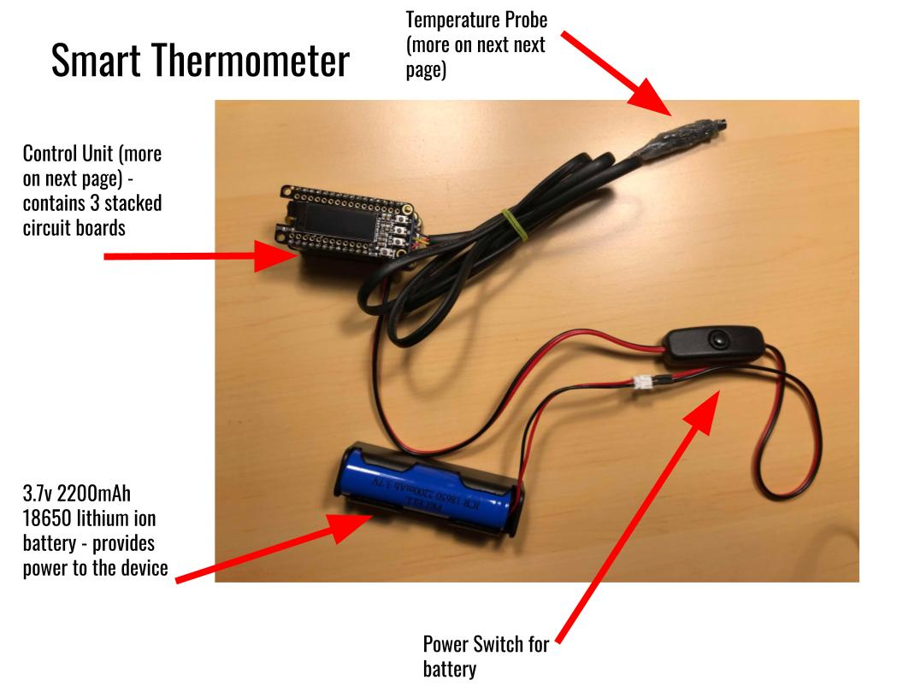
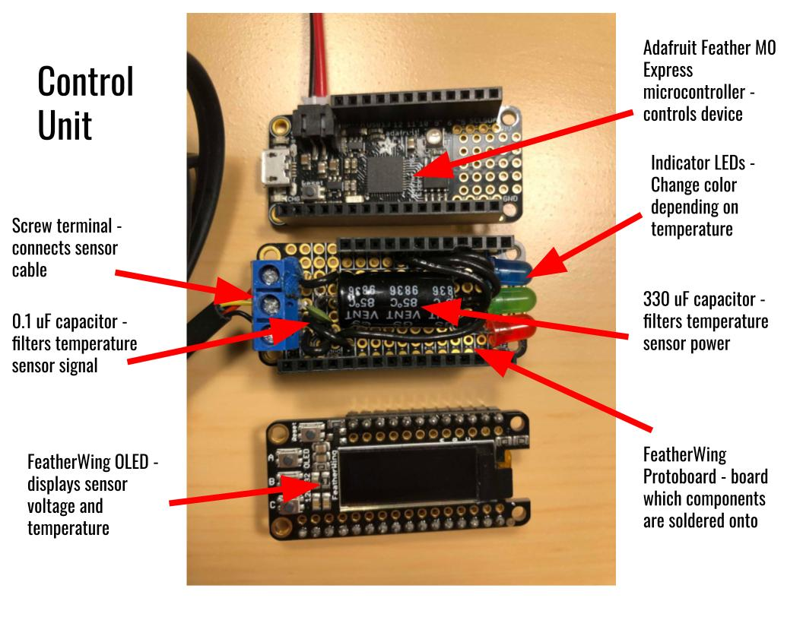
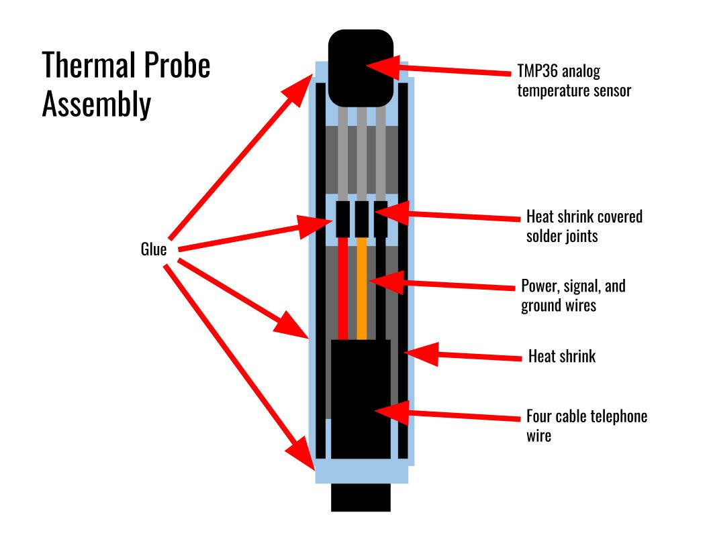

# Smart Thermometer

A very accurate portable thermometer with a OLED display, temperature range LEDs, and a Li Ion battery, powered by a Adafruit Feather M0 Express. Using the 12 bit ADC of the M0 and 2 filtering capacitors for power and data, the thermometer is able to get very precise readings from a custom made waterproof TMP36 probe, which are displayed on the OLED screen and indicated by red, green, and blue LEDs for different ranges. The device is also able to measure the remaining battery percentage from the battery voltage using a charge curve.

## Controller Unit

## Waterproof Probe

## BOM
- Adafruit Feather M0 Express
- FeatherWing OLED
- FeatherWing Protoboard
- TMP36 Temp Sensor
- 0.1 uF Capacitor
- 330 uF Capacitor
- Screw Terminal (for probe cable)
- Red, Green, and Blue LEDs
- 3.7v 2200 mAh 18650 Lithium Ion Battery
- 18650 Holder With JST 2 Pin Plug
- JST 2 Pin Inline Switch
- 4 Cable Telephone Wire
- Hot Glue
- Heat Shrink (various sizes)
- A few wires

## Instructions
1. Assemble the ProtoBoard: Connect pin 12 to the red LED, pin 11 to green, pin 10 to blue, and pin A0 to the center of the screw terminal. Connect GND for the LEDs. Connect 3.3V to the left pin of the screw terminal and GND to the right. Connect the 330 uF capacitor across the positive and negative (left and right) of the screw terminal. Connect the 0.1 uF capacitor across the signal and negative pin of the screw terminal (middle and right). 

2. Assemble the probe: Put pieces of heat shrink on each internal cable of the telephone wire, then solder each cable to the TMP36 sensor (their will be one extra). Remeber which colors correspond to VCC, GND, and data for the sensor, and connect the other end of the telephone wire to the terminal block. Shrink the heat shrink on, then cover all the joints in hot glue to ensure waterproofing. Cover the glue in another layer of heat shrink, then coat in hot glue. Make sure the top of the TMP36 sensor is still exposed.

3. Install the Adafruit_GFX and Adafruit_SSD1306 Arduino libraries. Flash the code onto the Feather board.

4. Insert the 18650 battery into the holder, then connect it to the switch and then to the Feather board.

5. Turn the switch on, and the thermometer should work!
